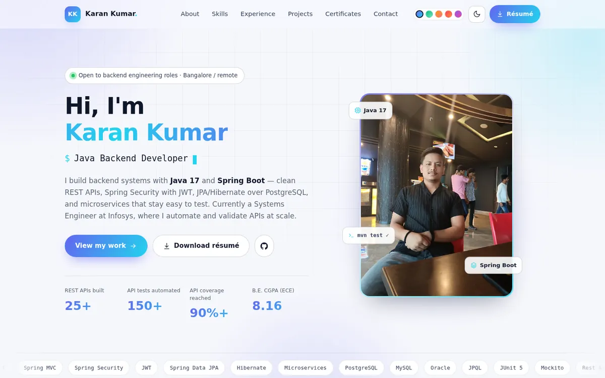

<div align="center">

# Karan Kumar — Developer Portfolio

**Java backend developer** — I build REST APIs, microservices and the test suites that keep them honest.

[](https://karankumarweb.github.io/portfolio/)
[](#tech)
[](#tech)
[](LICENSE)

[**View the live portfolio →**](https://karankumarweb.github.io/portfolio/)



<sub>Desktop · <a href="assets/img/preview-mobile.webp">mobile view</a></sub>

</div>

---

## About

Java-focused engineer with **7+ months at Infosys** building Java-based REST API automation — validating payloads,
status codes, headers, auth and business rules across **150+ API scenarios**. I've designed **25+ RESTful endpoints**
for a Spring Boot microservices platform, wired them to PostgreSQL through JPA/Hibernate, and secured them with
Spring Security + JWT.

This repository holds my personal portfolio site — a single page covering my skills, experience, projects and
certificates, plus a downloadable résumé.

## Features

- **Hero** with an animated typing role, aurora background and count-up stats
- **About** with quick facts and a short professional summary
- **Skills** grouped into languages, Spring/backend, databases, testing, DevOps and AI
- **Experience & education** timelines (Infosys, SLIET, schooling) with highlighted results
- **Projects** — two detailed feature panels plus a grid of six more projects
- **Certificates** with a click-to-zoom lightbox
- **Contact** with a form that composes an email, plus copy-to-clipboard for the address
- **Dark / light mode** and **five accent colours**, remembered in `localStorage`
- Responsive from 320 px phones to wide desktops, keyboard accessible, and it honours
  `prefers-reduced-motion`

## Tech

Plain **HTML, CSS and JavaScript** — no build step, no framework, no dependencies.

- Inline SVG icon sprite, so there is no icon-font request
- `IntersectionObserver` for scroll reveals, stat counters and active-section highlighting
- Inter, Sora and JetBrains Mono from Google Fonts, with system-font fallbacks
- WebP imagery (9.3 MB of originals optimised to ~540 KB), lazy-loaded below the fold
- SEO: meta description, Open Graph/Twitter cards, JSON-LD `Person` schema, SVG favicon
- Graceful degradation: content stays visible with JavaScript disabled

## Project structure

```
.
├── index.html               # the single-page site
├── 404.html                 # not-found page for GitHub Pages
├── assets/
│   ├── css/style.css        # design tokens, themes and all layout
│   ├── js/main.js           # theme, nav, animations, lightbox, form
│   ├── img/                 # WebP portraits, project shots, certificates, previews
│   └── docs/Resume.pdf      # downloadable résumé
├── .nojekyll                # serve files as-is on GitHub Pages
└── README.md
```

## Run locally

Any static server works — nothing to install:

```bash
git clone https://github.com/Karankumarweb/portfolio.git
cd portfolio
python3 -m http.server 8000
# open http://localhost:8000
```

## Deploy

Published with **GitHub Pages** straight from this repository:

1. Push to `main`
2. Settings → Pages → Source: *Deploy from a branch* → `main` / `root`
3. Live at `https://karankumarweb.github.io/portfolio/` within a minute

## Editing content

| What | Where |
| --- | --- |
| Text, projects, certificates | `index.html` |
| Colours, spacing, type scale | `:root` variables at the top of `assets/css/style.css` |
| Accent presets | `html[data-accent="…"]` rules in `style.css` and the `.swatch__dot` buttons in `index.html` |
| Résumé | replace `assets/docs/Resume.pdf` |

## Contact

- Email: **kk4447058@gmail.com**
- Phone: **+91 87572 80393**
- GitHub: [@Karankumarweb](https://github.com/Karankumarweb)

---

© 2026 Karan Kumar · Code released under the [MIT License](LICENSE) · Résumé and certificate
images remain the property of their respective owners.
