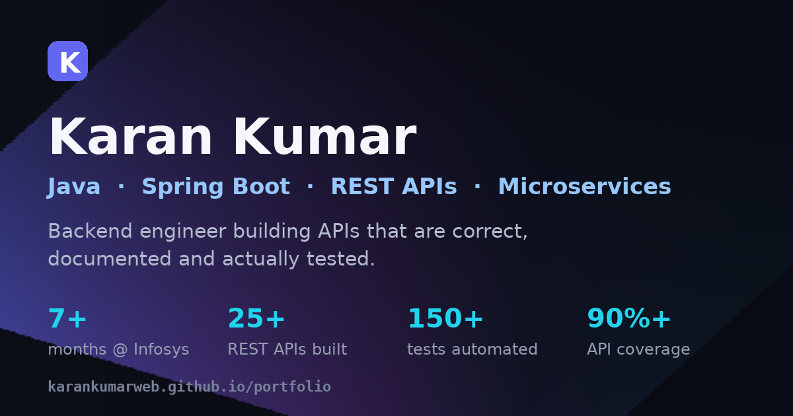

<div align="center">

# Hi, I'm Karan Kumar 👋

**Java &amp; Spring Boot developer** — I build REST APIs, microservices and the test suites that keep them honest.

[](https://karankumarweb.github.io/portfolio/)
[](#-tech-stack)
[](#-tech-stack)
[](LICENSE)

[**View the live portfolio →**](https://karankumarweb.github.io/portfolio/)



</div>

---

## 👨‍💻 About

Java-focused engineer with **7+ months at Infosys** building Java-based REST API automation — validating
payloads, status codes, headers, auth and business rules across **150+ API scenarios**. I've designed
**25+ RESTful endpoints** for a Spring Boot microservices platform, wired them to PostgreSQL with
JPA/Hibernate, and secured them with Spring Security + JWT.

I started out on the front end (HTML/CSS/JS), which is where my eye for detail and this site comes from.

- 🌱 Currently deepening **Spring Boot · Microservices · Spring AI**
- 🎯 Looking for **Java / Spring Boot backend roles**
- 📍 Bangalore, India
- 📄 [Résumé (PDF)](Resume.pdf)

## ✨ What's in this site

- **Dark &amp; light themes** — toggle in the header, remembers your choice, respects `prefers-color-scheme`
- **Animated hero** — typewriter role text, floating tech chips, gradient glow, count-up stats on scroll
- **Filterable project grid** — All / Backend / Frontend / Hardware &amp; games
- **Certificate lightbox** — click any certificate to view it full-size, closable with `Esc`
- **Working contact form** — validates inline, then hands off to your mail client pre-filled
- **Scroll-spy navigation**, reading-progress bar, scroll-reveal animations, `IntersectionObserver` throughout
- **Accessible** — semantic landmarks, skip link, focus-visible rings, ARIA labels, keyboard-operable, respects `prefers-reduced-motion`
- **Responsive** from 320 px up, plus a print stylesheet
- **Zero dependencies** — no frameworks, no build step, no `npm install`

## 🛠 Tech stack

| Layer | What I used |
|---|---|
| Markup | Semantic HTML5, inline SVG icon sprite |
| Styling | Hand-written CSS with custom properties, Grid, Flexbox, `@supports` fallbacks |
| Behaviour | Vanilla JavaScript (ES5-safe IIFE), `IntersectionObserver`, `localStorage` |
| Type | Plus Jakarta Sans &amp; JetBrains Mono via Google Fonts |
| Imagery | WebP, ~530 KB total for the whole site |

## 📁 Project structure

```
.
├── index.html                     # the whole site — one page, semantic sections
├── Resume.pdf                     # downloadable CV
├── assets/
│   ├── css/style.css              # design tokens, components, responsive + print rules
│   ├── js/main.js                 # theme, nav, animations, filters, lightbox, form
│   └── img/                       # optimised WebP portraits, projects & certificates
├── .nojekyll                      # serve assets/ as-is on GitHub Pages
└── LICENSE
```

## 🚀 Run it locally

No build step — it's plain files. Clone and open, or serve the folder:

```bash
git clone https://github.com/Karankumarweb/portfolio.git
cd portfolio
python3 -m http.server 8080     # or: npx serve .
# open http://localhost:8080
```

## 📦 Deploying

The site is static and lives at the repository root, so **GitHub Pages** serves it directly
(*Settings → Pages → Source: Deploy from a branch → `main` / `root`*).

Any static host works the same way — Netlify, Vercel, Cloudflare Pages or an S3 bucket: publish the
repo root, no build command.

## 📬 Contact

| | |
|---|---|
| 📧 Email | [kk4447058@gmail.com](mailto:kk4447058@gmail.com) |
| 📞 Phone | [+91 87572 80393](tel:+918757280393) |
| 🐙 GitHub | [@Karankumarweb](https://github.com/Karankumarweb) |
| 📍 Location | Bangalore, Karnataka, India |

## 📄 License

Source code released under the [MIT License](LICENSE).
Personal content — the résumé, photographs and certificates — is **© Karan Kumar, all rights reserved**.

<div align="center">
<sub>Built from scratch. If you find a bug, <a href="https://github.com/Karankumarweb/portfolio/issues">open an issue</a>.</sub>
</div>
